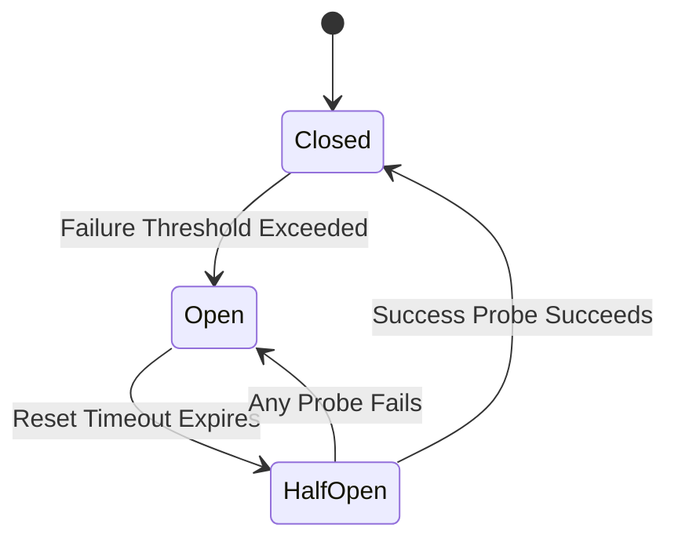

# 🛡️ Resiliency and Circuit Breakers Guidelines

> "No single failure should ever cascade and take down the entire system. Design for failure, and build bulkheads." — Michael T. Nygard (Release It!)
> "Chaos is the only constant. We build systems that expect failure, test for it continuously, and degrade gracefully under load." — Adrian Cockcroft (Netflix Architect)

---

## 📜 Core Philosophy
In distributed networks, failures are not anomalies; they are expected behaviors. A resilient system prevents failures in secondary dependencies from cascading into catastrophic global outages. We enforce strict timeout boundaries, protect downstream services using exponential backoff with random jitter, isolate system resources via bulkheads, and wrap remote integrations inside circuit-breaker state machines.

---

## 🏛️ Foundational Resiliency Mechanics

### 1. Defending Against Cascading Failures
*   **Cascading Failure**: Occurs when a slow database or external API locks up threads in the application server, causing the app server to exhaust its thread pool and drop all user traffic.
*   **The Remedy**: Always decouple dependencies using request timeouts and bulkheads.

### 2. Timeouts: The First Line of Defense
*   **Rule**: Never rely on default framework timeouts (which are often infinite). Set explicit connection timeouts and read timeouts on every network client.
    *   *Default HTTP Client Timeout*: Limit to 3-5 seconds for interactive user-facing actions.
    *   *Default Database Query Timeout*: Limit to 2-3 seconds to prevent locking table pools.

### 3. Exponential Backoff with Random Jitter
When retrying failed requests, you must space out the retry attempts to avoid overwhelming the recovering server.
*   **Exponential Backoff**: Double the delay after each failure:
    $$t_{delay} = t_{base} \times 2^{\text{attempt}}$$
*   **Random Jitter (Crucial)**: Add random noise to the delay:
    $$t_{\text{jittered}} = \text{random}(0, t_{delay})$$
    *   *Why*: Without jitter, multiple client instances that failed simultaneously will retry at the exact same milliseconds, creating a synchronized wave of traffic (Thundering Herd) that knocks the server back offline.

---

## 🔌 The Circuit Breaker State Machine

Wrap all external network clients, API consumers, and database adapters in a circuit-breaker pattern:



1.  **Closed State**:
    *   *Behavior*: Requests pass through to the remote service normally.
    *   *Tracking*: Track failure and success ratios. If the failure rate exceeds the limit (e.g., 50% of the last 20 requests fail), trip the breaker to **Open**.
2.  **Open State**:
    *   *Behavior*: All requests are short-circuited immediately. The remote service is *never* called. The client immediately returns a fallback state or fails fast.
    *   *Timer*: Start a reset timer (e.g., 30 seconds). When the timer expires, transition the state to **Half-Open**.
3.  **Half-Open State**:
    *   *Behavior*: Allow a small number of probe requests (e.g., 5 requests) to reach the remote service.
    *   *Reset/Trip*: If all probe requests succeed, reset to **Closed**. If any probe request fails, immediately trip back to **Open** and restart the reset timer.

---

## 🚪 Bulkheads & Graceful Fallbacks

### 1. Bulkhead Isolation
*   **Isolate Resource Pools**: Name-space thread pools or connection pools so that if one service exhausts its resources, other services remain operational.
    *   *Example*: Use separate thread pools/queues for processing file uploads vs. rendering dashboard queries. A flood of upload requests will saturate the upload bulkhead but leave the dashboard responsive.

### 2. Graceful Degradation (Fallbacks)
When a request fails or the circuit is open, return a fallback layout instead of crashing the UI:
*   **Stale Data**: Serve the latest cached data from LocalStorage or Redis.
*   **Default Layout**: Render a static configuration or fallback UI structure (e.g., hide the recommendation banner instead of failing to render the entire store page).
*   **Safe Defaults**: Return mock empty responses (`[]`) or cached profiles.

---

## 🛠️ First-Principles Application Examples (Illustrative Stack: Bun, Axios, Swift URLSession)

> [!IMPORTANT]
> **DO NOT FORCE A TECH STACK CHANGE**: You must detect the project's existing programming language and network libraries (e.g., Axios, standard Fetch, Python requests, Swift URLSession) and map these principles directly to those tools. Under no circumstances should you attempt to rewrite, migrate, or propose changing a codebase to Axios or custom wrappers unless explicitly requested by the user. The stack below is purely illustrative.

### 1. Request Timeouts (e.g., Axios / Fetch AbortController)
*   **Principle**: *Enforce client termination of outstanding sockets after a set period.*
*   *Application*: In JavaScript fetch, instantiate an `AbortController`. Set a `setTimeout` to call `controller.abort()` when the duration limit is reached, passing the controller's signal to the fetch call.

### 2. Exponential Jitter Implementation (e.g., TypeScript Helper)
*   **Principle**: *Apply randomized math delay spacing between retries.*
*   *Application*: Write pure utility functions that compute jittered delays:
    ```typescript
    function getJitteredDelay(attempt: number, base: number = 100, max: number = 3000): number {
      const backoff = Math.min(max, base * Math.pow(2, attempt));
      return Math.random() * backoff;
    }
    ```

### 3. iOS URLSession Resilience (e.g., Swift Concurrency retry)
*   **Principle**: *Protect mobile network tasks from immediately failing due to transient connection drops.*
*   *Application*: Wrap Swift `URLSession` data tasks in structured tasks that check network availability flags, wait using `Task.sleep` with jitter delays, and degrade to a local cache-store path if retries are exhausted.
