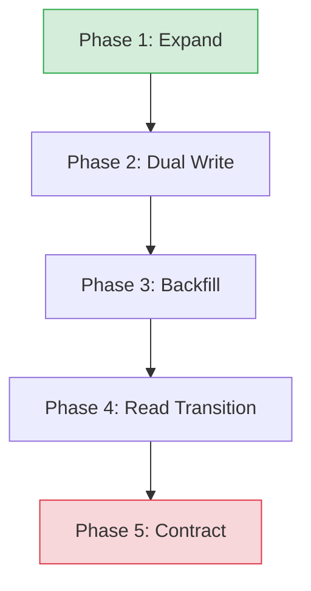

# 🚀 Web Deployment and Release Rules

> "If it hurts, do it more frequently, and bring the pain forward." — Jez Humble

---

## 📜 Core Philosophy
Deployment is a core engineering capability, not an afterthought. A robust release workflow is continuous, automated, and designed from the ground up to prevent user-facing downtime. We follow the 12-Factor App methodology, isolate build environments using multi-stage containerization, optimize edge delivery via CDNs, and execute database changes using backward-compatible migration patterns.

---

## 🏗️ The 12-Factor App (Key Architectural Constraints)
1.  **Config in the Environment**: Never hardcode credentials, API keys, or database URLs. Store them exclusively in environment variables (`process.env` or `ProcessInfo.processInfo.environment`).
2.  **Stateless Processes**: Execute the application as one or more stateless processes. Share nothing. Any data that needs to persist must be stored in a stateful backing service (database, cache, S3).
3.  **Disposability**: Minimize startup time (quick scale-out) and handle shutdown gracefully.
    *   *SIGTERM Handling*: Upon receiving `SIGTERM`, stop accepting new incoming requests, complete outstanding requests (connection draining), flush logging buffers, and terminate cleanly within a 30-second window.

---

## 🐳 High-Performance Multi-Stage Docker Builds
Minimize production attack surfaces and image size:
```dockerfile
# Stage 1: Build environment
FROM node:20-alpine AS builder
WORKDIR /app
COPY package*.json ./
RUN npm ci
COPY . .
RUN npm run build

# Stage 2: Minimal runner environment
FROM node:20-alpine AS runner
WORKDIR /app
ENV NODE_ENV=production
RUN addgroup --system --gid 1001 nodejs
RUN adduser --system --uid 1001 nextjs

# Copy only compiled assets and production dependencies
COPY --from=builder /app/public ./public
COPY --from=builder --chown=nextjs:nodejs /app/.next/standalone ./
COPY --from=builder --chown=nextjs:nodejs /app/.next/static ./.next/static

USER nextjs
EXPOSE 3000
CMD ["node", "server.js"]
```
*   *Rule*: Never run container processes as the `root` user. Use `USER` to run as a non-privileged system user.

---

## 🔄 Zero-Downtime Releases

### 1. Blue-Green Deployment
*   Maintain two identical physical production environments (Blue and Green).
*   Active traffic points to Blue. Deploy code to Green.
*   Run validation smoke tests on Green. If successful, point the load balancer to Green.
*   Keep Blue idle for instant rollback if anomalies are detected.

### 2. Canary Deployment
*   Route a tiny fraction of user traffic (e.g., 2%) to a single instance running the new version.
*   Compare automated telemetry (latency, error rates) against the baseline.
*   Slowly scale traffic to 10%, 50%, and finally 100%. If error budget consumption burns rapidly, trigger an automated rollback to the safe version.

---

## 🗄️ Zero-Downtime Database Migrations (Expand-and-Contract)
Never run destructive migrations (like renaming or deleting columns) directly on a running system, as this breaks active nodes running the previous version of the code.



1.  **Phase 1: Expand (DB Change)**: Add the new column/table. Ensure it is optional (nullable) or has a default value so the current app version can continue writing to the database without knowing about it.
2.  **Phase 2: Dual Write (Code Deploy)**: Deploy a new version of the app that writes updates to *both* the old and new columns, but still reads exclusively from the old column.
3.  **Phase 3: Backfill (Data Sync)**: Run an asynchronous background script to copy historical data from the old column to the new column for all pre-existing rows.
4.  **Phase 4: Read Transition (Code Deploy)**: Deploy a code update that reads from and writes to the *new* column. The old column is now unused by the active app.
5.  **Phase 5: Contract (DB Change)**: Run a final database migration to delete/drop the old column/table.

---

## 🛠️ First-Principles Application Examples (Illustrative Stack: Netlify Deployments, Bun runtime, Drizzle Migrations, Trigger.dev)

> [!IMPORTANT]
> **DO NOT FORCE A TECH STACK CHANGE**: You must detect the project's existing build, host, and deployment stack (e.g., GitHub Actions, Vercel, AWS, Docker, Kubernetes, Terraform) and map these principles directly to those tools. Under no circumstances should you attempt to rewrite, migrate, or propose changing a codebase or deploy pipeline to Netlify, Bun, Drizzle Kit, or Trigger.dev unless explicitly requested by the user. The stack below is purely illustrative.

### 1. Serverless Execution Adapters (e.g., Netlify SvelteKit Adapter)
*   **Principle**: *Optimize host configurations for serverless execution by deploying light routing wrappers as low-latency edge edge functions.*
*   *Application*: Leverage specific build adapters (like `adapter-netlify`) to map framework layouts directly to edge endpoints, using standard runtime configuration bounds.

### 2. Automated Schema Migration Gates (e.g., Drizzle Kit Migrate)
*   **Principle**: *Block application binary deployments at the pipeline stage if pending schema migrations fail to execute.*
*   *Application*: Incorporate CLI tools (like `drizzle-kit migrate`) directly within GitHub Actions/CI build scripts prior to deploy triggers, preventing broken query bindings in production.

### 3. Asynchronous Workload Decoupling (e.g., Trigger.dev)
*   **Principle**: *Never execute heavy, long-running computation processes within HTTP server request threads; offload to background queues.*
*   *Application*: Offload processing tasks (e.g., media manipulation, bulk alerts) from SvelteKit endpoints to Trigger.dev jobs. Respond with `202 Accepted` immediately, and poll or sync progress asynchronously.

### 4. Container Footprint Minimization (e.g., Bun Runtime)
*   **Principle**: *Build lightweight application images using multi-stage compilation to minimize container startup time and memory footprint.*
*   *Application*: Package application runtimes using compact bases (like alpine with Bun or Node) to maintain small image sizes, leading to faster scale-out speeds in cloud container environments.
